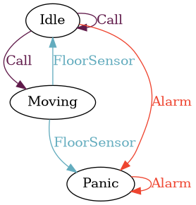
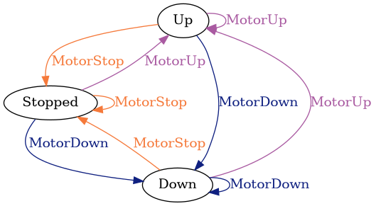

Elevator Project
================

Example implementation of a simplified elevator logic, using [TinyFSM].

  [TinyFSM]: https://digint.ch/tinyfsm/

Overview
--------

Imagine a elevator having:

 - "Call" button on each floor,
 - "Floor Sensor" on each floor, triggering an event as soon as the
   elevator arrives there,
 - "Alarm" button.

Implementation
--------------

The elevator example implements two state machines interacting with
each other:

 1. Elevator
    - State: Idle
    - State: Moving
    - State: Panic

 2. Motor
    - State: Stopped
    - State: Up
    - State: Down

A good state machine design avoids circular dependencies at all
cost: While the elevator sends events to the motor, the motor NEVER
sends events to the elevator (top-down only).

FAQ
---

Did you notice the motor starting twice? This is by design, let's
have a look at the call stack of fsm_list::start() in main.cpp:

    FsmList<Motor, Elevator>::start()
       Motor::set_initial_state()
          Motor::current_state = Stopped
       Elevator::set_initial_state()
          Elevator::current_state = Idle
       Motor::enter()
          Motor:Stopped->entry()
             cout << "Motor: stopped"               <-- HERE
             Motor::direction = 0
       Elevator::enter()
          Elevator:Idle->entry()
             send_event(MotorStop)
                Motor::react(MotorStop)
                   Motor:Stopped->transit<Stopped>
                      Motor:Stopped->exit()
                      Motor::current_state = Stopped
                      Motor:Stopped->entry()
                         cout << "Motor: stopped"   <-- HERE
                         Motor::direction = 0
                Elevator::react(MotorStop)

If we really had to work around this, we could either:

 1. Change the initialization (bad design practice!) in main.cpp:

        - fsm_list::start();
        + fsm_list::set_initial_state();
        + Elevator::enter();

 2. Modify the Motor:Stopped->entry() function in motor.cpp:

          class Stopped : public Motor {
            void entry() override {
        +     if(direction == 0)
        +       return;
              cout << "Motor: stopped" << endl;
              direction = 0;
            };
